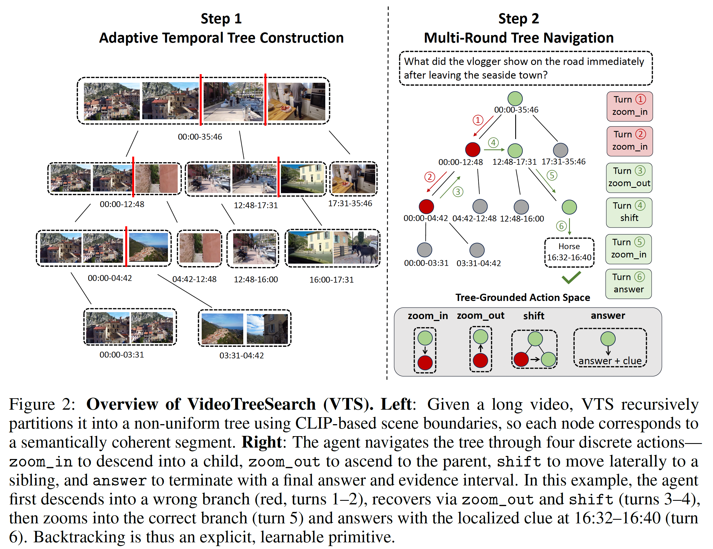

# Searching Videos as Trees: Self-Correcting Agents for Grounded Long Video QA

Ce Zhang<sup>1</sup>, Ziyang Wang<sup>1</sup>, Yulu Pan<sup>1</sup>, Oluwatumininu Oguntola<sup>1</sup>, Pranav Wagh<sup>1</sup>, Qiyu Wu<sup>2</sup>, Hiromi Wakaki<sup>2</sup>, Mohit Bansal<sup>1</sup>, Gedas Bertasius<sup>1</sup>

<sup>1</sup>University of North Carolina at Chapel Hill &nbsp;&nbsp; <sup>2</sup>Sony

## Introduction

Grounded long-video question answering (Grounded LVQA) requires answering a question about a long video while localizing the short evidence interval that supports the answer. Recent agentic methods frame this task as multi-turn exploration with a single `crop_video(start, end)` action, which supports coarse-to-fine narrowing but provides no primitive for fine-to-coarse backtracking. As a result, these agents typically converge in two turns and cannot recover from an early wrong descent.

We propose **VideoTreeSearch (VTS)**, a framework that casts grounded LVQA as iterative self-correcting search over an adaptive temporal tree. VTS constructs a non-uniform tree from visual scene boundaries so that each node corresponds to a semantically coherent segment, and trains an agent to navigate the tree through four discrete operations: `zoom_in`, `zoom_out`, `shift`, and `answer`. These operations expose backtracking and recovery as explicit, learnable primitives rather than implicit behaviors. To train this navigation, we introduce a trajectory synthesis pipeline that produces multi-step paths through the tree, including deliberate detours into incorrect branches followed by recovery. We use these trajectories for supervised fine-tuning, followed by reinforcement learning with grounding and answer-accuracy rewards.

On three Grounded LVQA benchmarks (CG-Bench, Haystack-LVBench, Haystack-Ego4D), VTS outperforms the strongest prior agentic methods by +12.5 mIoU on CG-Bench and +7.4 T-F1 on Haystack-Ego4D. The learned policy also transfers to general long-video QA, surpassing all prior agentic baselines on Video-MME, MLVU, and LVBench by up to +7.1 accuracy points.

<p align="center">
  
</p>

## Repository structure

```
VTS/
├── infer/   # Inference: tree-search agent over a vLLM-served VLM
├── sft/     # Supervised fine-tuning on synthesized trajectories (LLaMA-Factory configs)
└── rl/      # (coming soon) Reinforcement learning with grounding + answer rewards
```

## Model checkpoint

Our VTS model (Qwen3-VL-8B-Instruct backbone, after SFT + RL) is on the Hugging Face Hub:

- **`ceezh/VTS-Qwen3-VL-8B`** — https://huggingface.co/ceezh/VTS-Qwen3-VL-8B

## Setup

We use [uv](https://docs.astral.sh/uv/) for environment management (Python 3.12).

```bash
git clone https://github.com/CeeZh/VTS.git
cd VTS/infer
uv sync
source .venv/bin/activate
```

This installs the inference dependencies (including `vllm` for serving) declared in [infer/pyproject.toml](infer/pyproject.toml).

## Inference

Inference is a two-step process: (1) serve the VLM with vLLM, (2) run the tree-search agent against the served endpoint.

### 1. Serve the model

Start a vLLM OpenAI-compatible server:

```bash
vllm serve ceezh/VTS-Qwen3-VL-8B \
  --port 1234 \
  --data-parallel-size 8 \
  --max-model-len 65536 \
  --async-scheduling \
  --allowed-local-media-path /
```

You can substitute any other Qwen3-VL-compatible checkpoint (e.g. `Qwen/Qwen3-VL-8B-Instruct` for the base model).

### 2. (Optional) Serve a CLIP scene-segmentation backend

Tree nodes are constructed from CLIP-derived scene boundaries. Start a CLIP gRPC server (`clip-server`) — any open-clip-compatible model works:

```bash
python -m clip_server  # default: grpc://localhost:51000
```

If you prefer fixed uniform splits, skip this and pass `--segment-mode uniform` to the agent.

### 3. Run the agent

From [infer/](infer/):

```bash
python example_inference.py -n -1 -w 40 -d cgbench_mini \
    --base-url http://localhost:1234/v1 \
    --model ceezh/VTS-Qwen3-VL-8B \
    --clip-url grpc://localhost:51000 \
    --save-prompts \
    --scene-max-frames 64 \
    -o ./output/cgbench_mini/vts \
    --action-mode segmented \
    --memory-frames-per-node 0 \
    --max-frames 64 \
    --max-turns 15 \
    --separate-caption-generation \
    --resume
```

Key arguments:

- `-d` — dataset (`cgbench`, `cgbench_mini`, `lvhaystack_ego4d`, `lvhaystack_longvideobench`, `lvbench`, `videomme`, `mlvu`, `longvideobench`, `momentseeker`).
- `--anno-path` / `--video-base-path` — point these at your local copies of the dataset.
- `--base-url` — URL of the vLLM server from step 1.
- `--model` — must match the `vllm serve` model id.
- `-w` — number of parallel worker threads.
- `-o` — output directory; per-sample JSONs, tree visualizations, and `summary.json` are written here.

Run `python example_inference.py --help` for the full argument list.

## SFT

We fine-tune Qwen3-VL-8B-Instruct (or Qwen2.5-VL-7B-Instruct) on synthesized tree-search trajectories using [LLaMA-Factory](https://github.com/hiyouga/LLaMA-Factory). The [sft/](sft/) folder holds only the training configs — the trainer itself lives in LLaMA-Factory.

### 1. Environment

```bash
git clone https://github.com/hiyouga/LLaMA-Factory.git
cd LLaMA-Factory
uv venv --python 3.12
source .venv/bin/activate
uv pip install -e ".[torch,metrics,deepspeed]"
uv pip install flash-attn --no-build-isolation
```

### 2. Drop the VTS SFT configs into LLaMA-Factory

From inside the `LLaMA-Factory` checkout, link this repo's `sft/` folder in as `vts_sft/` (a copy works too — the configs reference paths relative to LLaMA-Factory's root):

```bash
ln -s /path/to/VTS/sft vts_sft
```

### 3. Provide the training data

Put your SFT trajectory JSON at `vts_sft/data/all_sft.json`. It should follow LLaMA-Factory's ShareGPT format (the schema is already declared in [sft/data/dataset_info.json](sft/data/dataset_info.json) — `messages` + `images` columns). Each sample is one full multi-turn trajectory: a system prompt, the user's video+question turn, and the assistant's `ZOOM_IN` / `ZOOM_OUT` / `SHIFT` / `ANSWER` decisions interleaved with observations.

### 4. Launch training

Single node, 4 GPUs (matches the slurm script in [sft/train.slurm](sft/train.slurm)):

```bash
# from the LLaMA-Factory root
python -m llamafactory.cli train vts_sft/sft_qwen3.yaml       # Qwen3-VL-8B
# or
python -m llamafactory.cli train vts_sft/sft_qwen2.5.yaml     # Qwen2.5-VL-7B
```

Or as a slurm job:

```bash
sbatch vts_sft/train.slurm
```

Key knobs in the YAML configs ([sft_qwen3.yaml](sft/sft_qwen3.yaml), [sft_qwen2.5.yaml](sft/sft_qwen2.5.yaml)):

- `model_name_or_path` — base VLM to fine-tune.
- `freeze_vision_tower` / `freeze_multi_modal_projector` — both `true`: only the LLM is trained.
- `cutoff_len: 32768` — long enough for full multi-turn trajectories with frames.
- `deepspeed: examples/deepspeed/ds_z3_config.json` — ZeRO-3 from LLaMA-Factory's bundled configs.
- `output_dir` — checkpoint destination, relative to the LLaMA-Factory root.

The trajectory synthesis pipeline that produces `all_sft.json` will be released in a follow-up.

## RL

Coming soon.
