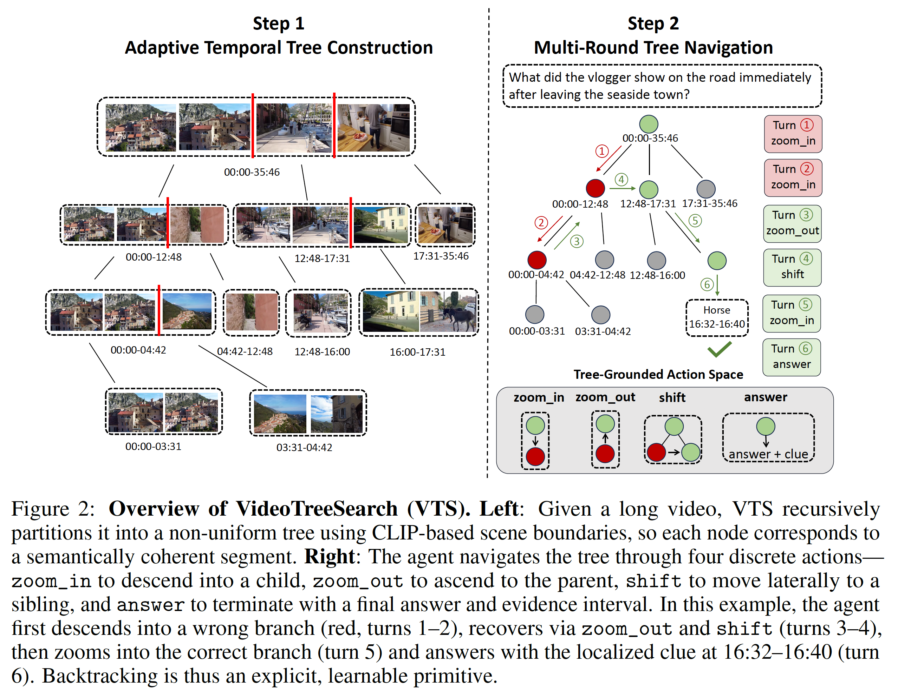

# Searching Videos as Trees: Self-Correcting Agents for Grounded Long Video QA

Ce Zhang<sup>1</sup>, Ziyang Wang<sup>1</sup>, Yulu Pan<sup>1</sup>, Oluwatumininu Oguntola<sup>1</sup>, Pranav Wagh<sup>1</sup>, Qiyu Wu<sup>2</sup>, Hiromi Wakaki<sup>2</sup>, Mohit Bansal<sup>1</sup>, Gedas Bertasius<sup>1</sup>

<sup>1</sup>University of North Carolina at Chapel Hill &nbsp;&nbsp; <sup>2</sup>Sony

## Introduction

Grounded long-video question answering (Grounded LVQA) requires answering a question about a long video while localizing the short evidence interval that supports the answer. Recent agentic methods frame this task as multi-turn exploration with a single `crop_video(start, end)` action, which supports coarse-to-fine narrowing but provides no primitive for fine-to-coarse backtracking. As a result, these agents typically converge in two turns and cannot recover from an early wrong descent.

We propose **VideoTreeSearch (VTS)**, a framework that casts grounded LVQA as iterative self-correcting search over an adaptive temporal tree. VTS constructs a non-uniform tree from visual scene boundaries so that each node corresponds to a semantically coherent segment, and trains an agent to navigate the tree through four discrete operations: `zoom_in`, `zoom_out`, `shift`, and `answer`. These operations expose backtracking and recovery as explicit, learnable primitives rather than implicit behaviors. To train this navigation, we introduce a trajectory synthesis pipeline that produces multi-step paths through the tree, including deliberate detours into incorrect branches followed by recovery. We use these trajectories for supervised fine-tuning, followed by reinforcement learning with grounding and answer-accuracy rewards.

On three Grounded LVQA benchmarks (CG-Bench, Haystack-LVBench, Haystack-Ego4D), VTS outperforms the strongest prior agentic methods by +12.5 mIoU on CG-Bench and +7.4 T-F1 on Haystack-Ego4D. The learned policy also transfers to general long-video QA, surpassing all prior agentic baselines on Video-MME, MLVU, and LVBench by up to +7.1 accuracy points.

<p align="center">
  
</p>

## Repository structure

```
VTS/
├── infer/   # Inference: tree-search agent over a vLLM-served VLM
├── sft/     # Supervised fine-tuning on synthesized trajectories (LLaMA-Factory configs)
└── rl/      # GRPO fine-tuning with tree-search multi-turn rollouts (ms-swift plugin)
```

## Model checkpoint

Our VTS model (Qwen3-VL-8B-Instruct backbone, after SFT + RL) is on the Hugging Face Hub:

- **`ceezh/VTS-Qwen3-VL-8B`** — https://huggingface.co/ceezh/VTS-Qwen3-VL-8B

## Dataset

All training and evaluation data is released as a Hugging Face dataset:

- **`ceezh/VTS_data`** — https://huggingface.co/datasets/ceezh/VTS_data

Download it (the paths below are relative to the downloaded `data/` root):

```bash
huggingface-cli download ceezh/VTS_data --repo-type dataset --local-dir data
```

| path                          | what                                                                                                                |
| ----------------------------- | ------------------------------------------------------------------------------------------------------------------- |
| `sft/sft.json`              | SFT trajectories, LLaMA-Factory ShareGPT format (used by[SFT](#sft))                                                   |
| `rl/rl.json`                | RL training records, JSONL (used by[RL](#rl))                                                                          |
| `tree_cache/`               | pre-built scene trees consumed by RL rollouts                                                                       |
| `trajectories/`             | raw synthesized search trajectories (source for`sft.json`)                                                        |
| `annotations/`              | inference / evaluation annotations — CG-Bench mini, Haystack-Ego4D, Haystack-LVBench (used by[Inference](#inference)) |
| `videos/longclueqa_youtube_ids.txt` | YouTube IDs of the LongClueQA videos (download them yourself — see[Videos and frames](#videos-and-frames))   |
| `scripts/download_longclueqa.py` | download the LongClueQA videos from YouTube                                                                     |
| `video_ids.json`            | the video IDs referenced by the records / annotations, split into `train` / `test` (used by frame extraction)     |
| `scripts/extract_frames.py` | extract 1 fps frames from videos                                                                                    |
| `scripts/extract_frames.sbatch` | SLURM wrapper that runs the frame extraction (uses the `cpu_lowest` QoS)                                       |
| `dataset_info.json`         | LLaMA-Factory dataset manifest for SFT (lets you point`dataset_dir` straight at this folder)                      |

### Videos and frames

Download the videos and place them at `videos/<dataset>/<video_id>.mp4`.

- **`longclueqa`** — sourced from public YouTube videos. The dataset includes the source YouTube IDs
  (`videos/longclueqa_youtube_ids.txt`). Download the videos with the provided
  script:

  ```bash
  uv pip install yt-dlp
  python data/scripts/download_longclueqa.py \
      --out-dir data/videos/longclueqa \
      --workers 4
  ```

  Each YouTube ID *is* the `<video_id>`, so downloads land at
  `videos/longclueqa/<video_id>.mp4`.
- **`cgbench`** — download from [CG-Bench](https://huggingface.co/datasets/CG-Bench/CG-Bench)
  into `videos/cgbench/<video_id>.mp4`.
- **`lvhaystack_ego4d`** — Ego4D source videos from
  [LongVideoHaystack](https://huggingface.co/datasets/MLL-Lab/LongVideoHaystack)
  ([Ego4D](https://ego4d-data.org/) requires signing the Ego4D license); place
  them at `videos/lvhaystack_ego4d/<video_id>.mp4` (the `extract` step also
  accepts `videos/ego4d/<video_id>.mp4`).
- **`lvbench`** (evaluation only) — download from
  [LongVideoBench](https://huggingface.co/datasets/longvideobench/LongVideoBench)
  into `videos/lvbench/<video_id>.mp4` (the `extract` step also accepts
  `videos/longvideobench/<video_id>.mp4`).

Then extract 1 fps frames for SFT / RL training:

```bash
python data/scripts/extract_frames.py extract \
    --video-ids data/video_ids.json \
    --videos-root data/videos \
    --frames-root data/frames \
    --split all \
    --workers 16
```

Link the huggingface data folder (including raw videos, frames, annotations, etc.) to `./data`.

## Inference

Inference is a two-step process: (1) serve the VLM with vLLM, (2) run the tree-search agent against the served endpoint.

### 1. Environment

```bash
git clone https://github.com/CeeZh/VTS.git
cd VTS/infer
uv sync
source .venv/bin/activate
```

### 2. Serve the model

Start a vLLM OpenAI-compatible server:

```bash
vllm serve ceezh/VTS-Qwen3-VL-8B \
  --port 1234 \
  --data-parallel-size 8 \
  --max-model-len 65536 \
  --async-scheduling \
  --allowed-local-media-path /
```

You can substitute any other Qwen3-VL-compatible checkpoint (e.g. `Qwen/Qwen3-VL-8B-Instruct` for the base model).

### 3. (Optional) Serve a CLIP scene-segmentation backend

Tree nodes are constructed from CLIP-derived scene boundaries. Start a CLIP gRPC server (`clip-server`):

```bash
python -m clip_server  # default: grpc://localhost:51000
```

If you prefer fixed uniform splits, skip this and pass `--segment-mode uniform`
to the agent. You can also skip it whenever a **tree cache** is available: the
released dataset ships pre-built caches for `cgbench`/`cgbench_mini` and
`lvhaystack_ego4d` under `tree_cache/`, and the agent reads segment boundaries
straight from there (no CLIP contacted) — see `--tree-cache-dir` below.

### 4. Run the agent

From [infer/](infer/):

```bash
python example_inference.py -n -1 -w 40 -d cgbench_mini \
    --base-url http://localhost:1234/v1 \
    --model ceezh/VTS-Qwen3-VL-8B \
    --clip-url grpc://localhost:51000 \
    --scene-max-frames 64 \
    --save-prompts \
    --tree-cache-dir data/tree_cache/cgbench \
    -o ./output/cgbench_mini/vts \
    --max-frames 64 \
    --max-turns 15 \
    --separate-caption-generation \
    --resume
```

Key arguments:

- `-d` — dataset (`cgbench`, `cgbench_mini`, `lvhaystack_ego4d`, `lvhaystack_longvideobench`).
- `--anno-path` / `--video-base-path` / `--tree-cache-dir` — point these at your
  local copies of the dataset. For the datasets shipped in the released data
  (`cgbench_mini`, `lvhaystack_ego4d`), these default to the corresponding
  `data/annotations`, `data/videos/<dataset>`, and `data/tree_cache/<dataset>`
  paths (resolved relative to the repo root), so you can omit them if you have
  the dataset symlinked/downloaded to `data/`.
- `--base-url` — URL of the vLLM server from step 2.
- `--model` — must match the `vllm serve` model id.
- `-w` — number of parallel worker threads.
- `-o` — output directory; per-sample JSONs, tree visualizations, and `summary.json` are written here.

Run `python example_inference.py --help` for the full argument list.

## SFT

We fine-tune Qwen3-VL-8B-Instruct (or Qwen2.5-VL-7B-Instruct) on synthesized tree-search trajectories using [LLaMA-Factory](https://github.com/hiyouga/LLaMA-Factory). The [sft/](sft/) folder holds only the training configs — the trainer itself lives in LLaMA-Factory.

### 1. Environment

```bash
git clone https://github.com/hiyouga/LLaMA-Factory.git
cd LLaMA-Factory
uv venv --python 3.12
source .venv/bin/activate
uv pip install -e .
# optional dependency groups live in requirements/ (this version has no pip "extras"):
uv pip install -r requirements/metrics.txt -r requirements/deepspeed.txt
```

A fresh install may pull a bleeding-edge CUDA 13 / torch build whose bundled cuDNN
is broken (`CUDNN_STATUS_SUBLIBRARY_VERSION_MISMATCH` at the first training
step). Pin the known-good stack below (this is also what supports Qwen3-VL):

```bash
uv pip install torch==2.6.0 torchvision==0.21.0 torchaudio==2.6.0 \
    --index-url https://download.pytorch.org/whl/cu124
uv pip install transformers==4.57.1
```

The configs use PyTorch SDPA attention (`flash_attn: sdpa`), so **flash-attn is
not required**. FlashAttention-2 is an optional speedup — only install it if you
have a matching CUDA toolkit (e.g. `module load cuda/12.4.1` so `nvcc`/`CUDA_HOME`
match the torch cu124 build), then set `flash_attn: fa2` in the YAML:

```bash
uv pip install flash-attn==2.7.4.post1 --no-build-isolation   # optional
```

### 2. Train

Download the [dataset](#dataset) into `./data` and extract frames first (see
[Videos and frames](#videos-and-frames)). Then train **from the VTS repo root**
(all paths in the configs are relative to it — no symlinking or copying):

```bash
source ../LLaMA-Factory/.venv/bin/activate       # the SFT env
llamafactory-cli train ./sft/sft_qwen3.yaml      # Qwen3-VL-8B
# or
llamafactory-cli train ./sft/sft_qwen2.5.yaml    # Qwen2.5-VL-7B
```

`llamafactory-cli` auto-launches `torchrun` across all visible GPUs. The configs
point at `dataset_dir: data` (the downloaded folder, which ships
`dataset_info.json` -> `data/sft/sft.json`) and `media_dir: .` (the repo root),
because the image paths baked into `sft.json` are repo-root-relative
(`data/frames/<dataset>/...`) and thus resolve directly.

On SLURM, use the provided launcher (single node, 4x H100, `h100_comm_shared`
QoS). Submit it from the VTS repo root:

```bash
sbatch sft/train_sft.sbatch                                   # Qwen3-VL-8B, full run
CONFIG=./sft/sft_qwen2.5.yaml sbatch sft/train_sft.sbatch     # Qwen2.5-VL-7B
# quick smoke test (a few steps on a handful of samples):
EXTRA_ARGS="max_steps=10 max_samples=64 output_dir=/tmp/sft_smoke" \
    sbatch sft/train_sft.sbatch
```

Key knobs in the YAML configs ([sft_qwen3.yaml](sft/sft_qwen3.yaml), [sft_qwen2.5.yaml](sft/sft_qwen2.5.yaml)):

- `model_name_or_path` — base VLM to fine-tune.
- `freeze_vision_tower` / `freeze_multi_modal_projector` — both `true`: only the LLM is trained.
- `cutoff_len: 32768` — long enough for full multi-turn trajectories with frames.
- `deepspeed: ./sft/ds_z3_config.json` — ZeRO-3 config (bundled in this repo, copied from LLaMA-Factory).
- `dataset_dir: data` — folder with `dataset_info.json` (points to `data/sft/sft.json`).
- `media_dir: .` — repo root; the `data/frames/...` image paths in `sft.json` resolve from here.
- `flash_attn: sdpa` — attention backend (`fa2` if you installed flash-attn).
- `output_dir` — checkpoint destination.

The raw synthesized trajectories that `sft.json` is rendered from are in the
[released dataset](#dataset) under `trajectories/`. The trajectory synthesis
pipeline (the code that generates them) will be released in a follow-up.

## RL

After SFT we further fine-tune the policy with GRPO.

### 1. Environment

```bash
uv venv --python 3.11
source .venv/bin/activate
uv pip install "ms-swift==3.10.0"
uv pip install "vllm==0.11.0"          # pins a stable torch 2.8.0+cu128 (install after ms-swift)
# FlashAttention-2 wheel for torch 2.8 / cu12 / py311:
uv pip install "https://github.com/Dao-AILab/flash-attention/releases/download/v2.8.3/flash_attn-2.8.3+cu12torch2.8cxx11abiTRUE-cp311-cp311-linux_x86_64.whl"
uv pip install "qwen_vl_utils>=0.0.14" deepspeed "math_verify==0.5.2"
uv pip install "antlr4-python3-runtime==4.9.3"   # keep omegaconf/swift CLI working
```

Run `swift` from the VTS repo root — the plugin is loaded via `--external_plugins
rl/vts_plugin.py` (a repo-root-relative path), so no symlinking into an
ms-swift checkout is needed.

### 2. (If starting from an SFT checkpoint) Convert the checkpoint

LLaMA-Factory writes checkpoints for training; ms-swift/vLLM inference wants a
few config/tokenizer tweaks. Convert first (handles single-file and sharded
checkpoints):

```bash
python rl/scripts/convert_checkpoint.py \
  --checkpoint-dir output/vts_qwen3_vl_8b \
  --original-model-dir ~/.cache/huggingface/hub/models--Qwen--Qwen3-VL-8B-Instruct/snapshots/<snapshot> \
  --output-dir output/vts_qwen3_vl_8b-converted
```

(For a Qwen2.5-VL SFT run add `--copy-config-from-original`.)

### 3. Launch training

The dataset is `data/rl/rl.json` from the [released dataset](#dataset). Its `video_path`, `frames_base_dir`, and `tree_cache_dir` are
repo-root-relative, so run `swift` from the VTS repo root and extract frames
first (see [Videos and frames](#videos-and-frames)).

GRPO needs two GPU groups: one serves rollouts, the other runs policy updates and
connects to it over a port. On a single **4× H100** node, use **1 GPU for the
rollout server + 3 for training**. Run [rl/rollout.sh](rl/rollout.sh) first, then
[rl/grpo.sh](rl/grpo.sh) in a second shell; set `MODEL` on both (defaults are
otherwise repo-root-relative). Override GPU ids / batch knobs via the env vars
each script documents.

Key hyper-parameters:

- `--reward_funcs tree_acc_reward tree_format_reward tree_iou_reward tree_gt_distance_reward tree_debug_logger` — the reward stack (defined in [vts_plugin.py](rl/vts_plugin.py)).
- `--reward_weights 0.5 0.5 1.0 0.0 0.0` — combine answer accuracy, format, evidence-IoU, GT-distance, and a passthrough logger.
- `--train_type lora --lora_rank 32 --lora_alpha 64 --target_modules all-linear`
- `MAX_TURNS=10`, `NUM_FRAMES_PER_SEGMENT=64` — controlled by env vars that the plugin reads on startup.
- `--num_generations 8 --steps_per_generation 8 --beta 0.04` — GRPO sampling/regularization settings.

After RL, merge the LoRA adapter into the base policy with `swift export --adapter ... --merge_lora true`.
